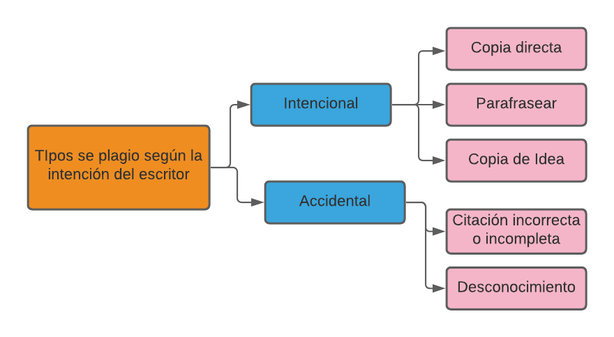

```{r setup, include=FALSE}
knitr::opts_chunk$set(echo = TRUE)
```

```{r include=FALSE}
# Especificamos las librerías necesarias en esta lista

packages = c("dplyr", "kableExtra","ngram","readr", "tidytext","tidyr","tm","stringr","caret","knitr")

#use this function to check if each package is on the local machine
#if a package is installed, it will be loaded
#if any are not, the missing package(s) will be installed and loaded
package.check <- lapply(packages, FUN = function(x) {
  if (!require(x, character.only = TRUE)) {
    install.packages(x, dependencies = TRUE)
    library(x, character.only = TRUE)
  }
})

#verify they are loaded
search()

```


# Introducción y motivación

En los últimos años, el plagio y su detección se han posicionado como un problema en crecimiento dentro del ámbito académico. Según la Real Academia Española (RAE), plagiar es la acción de copiar en lo sustancial obras ajenas dándolas como propias. En el caso de textos, plagiar es la acción de atribuirse la autoría de fragmentos o ideas cuya propiedad intelectual no le corresponde al autor [@intro]. 

Debido al aumento de este problema, han surgido diferentes soluciones por parte del mundo empresarial y del educativo. Entre otras, el desarrollo de sistemas para ayudar a los educadores en la ardua tarea de identificar trabajos plagiados, o incluso el desarrollo de sistemas que son capaces de detectar el plagio automáticamente.

Uno de los problemas de estos sistemas de detección de plagio es la falta de datos para entrenar los modelos ya que no hay muchos repositorios con textos que estén admitidos como plagiados. Esto se debe a la ilegalidad de publicar textos plagiados. Por eso, en este trabajo usaremos un corpus de texto plagiado que ha sido simulado por los investigadores y que está disponible para uso libre. 

A lo largo de este trabajo, explicaremos como funcionan algunos de estos detectores de plagio, incluyendo todas las etapas del proceso: 

\begin{itemize}

  \item Desarrollo de un corpus de textos.
  
  \item Preprocesado del texto previo al análisis.
  
  \item Comparación de textos a través de una métrica.
  
  \item Evaluación de resultados.
  
\end{itemize}

# Teoria


En este apartado desarrollamos los conceptos y técnicas necesarias para llevar a cabo más tarde en un caso práctico la construcción de un detector de plagio. Esta teoría esta subdividida en los diferentes pasos a seguir en la práctica para el tratado de los datos y la construcción y evaluación del modelo.

Atendiendo a los diferentes tipos de plagio y los métodos usados para su detección, podemos realizar distintas clasificaciones. A continuación se exponen algunas de ellas [@tipos1] [@tipos2]. 
_Nota: También es muy importante diferenciar respecto al objeto de estudio. Si se está analizando plagio en código, las técnicas no serás igual que si estamos tratando con un artículo científico. Nuestro interés se centra en texto plano y no en código._

La clasificación menos relevante para nuestro trabajo sería la que atiende a la intención de quien escribe el texto. Dicha clasificación podría ser [@intencion]:



Una de las clasificaciones que se hacen más comúnmente sobre el plagio, son las de plagio intrínseco y el plagio extrínseco.
* Plagio intrínseco: Se habla de plagio intrínseco cuando en un mismo documento o texto, cambia el estilo de redacción y se distinguen diferentes autores. Su nombre viene del hecho que no se requieren de bases de datos ni fuentes externas para la comparación. Como consecuencia, de dicho método solo podremos sacar una sospecha del plagio, pues no contaremos con la fuente del plagio.

* Plagio extrínseco: Donde los recursos originales o fuente del plagio son usados y comparados con el texto a analizar. El plagio no solo puede venir de una copia textual entre documento original y ejemplar (llamado _plagio literal_ o _copia-pega_), si se usan sinónimos y se reescriben las oraciones de manera similar, deberemos atender a la similitud entre ambos documentos (este tipo de plagio es llamado _plagio inteligente_). Esta similitud puede separarse en:
  * Similitud Semántica: Considerando el uso de sinónimos, se busca la similitud de la estructura por **palabras**.
  * Similitud Sintáctica: Se busca una similitud por oraciones, donde se le da relevancia a similitud entre oraciones a nivel sintáctico.
 

 
## Corpus
Un corpus lingüístico es un conjunto de textos variados que cumple la función de representar el uso real de la lengua que se quiere examinar. En el caso del procesamiento de texto es necesario contar con un corpus adecuado al campo y características que se buscan extraer. En nuestro caso hacemos uso del corpus proporcionado por miembros de la universidad de Sheffield [@corpus_source]. Consta de un set de 5 cuestiones que veinte alumnos tuvieron que responder. Los alumnos se dividieron en cuatro grupos que podían responder las preguntas con materiales externos o consultando páginas de Wikipedia, permitiéndose niveles diferentes de copia y referencia. De esta forma tenemos diferentes grados de plagio con el documento original, que van del corta y pega al no uso de la fuente, y una fácil comparación. Además de todas estas respuestas, también se proporciona un índice con el alumno que escribió cada texto, cual era la pregunta original y el nivel de copia (near copy, light revision, heavy revision, non- plagiarism) debidamente indexado. EN resumidas cuentas, nuestro corpus cuenta con 100 textos breves (entre 200 y 300 palabras) con diferentes niveles de plagio, de manera que son lo suficientemente largos para realizar un análisis didáctico sin convertirse en una carga difícil de procesar con nuestros medios.

## Preprocesado   

El preporcesado es el primer contacto con los datos, las primeras tareas de limpieza y formateo de los datos suelen ser por lo general sencillas y en su mayoría genéricas. 

Primero exponemos las funciones básicas para este propósito:
```{r}
#librerías para cargar los datos y preprocesarlos 

texto<-" ¡ Ésto és ún  TexTo De  çñ(Prúebá)"
#pasarlo a minúsculas
texto<-tolower(texto) 
texto
```


```{r}
#eliminar signos de puntuación, carácteres problemáticos
texto<-gsub("[[:punct:]]"," ",texto)
texto<-gsub("(\\n)|(\\t)"," ",texto)
texto

#y comprobar que no hay espacios repetidos y al principio y final del string (str_trim())
texto<-gsub("\\s+"," ",str_trim(texto))
#la función str_squish() de la librería stringr hace exactamente 
#elimilar los espacios en blanco al comienzo y al final del string
texto
```

En el caso de que el idioma tenga acentuación, sería recomendable eliminarla para no tener problemas de formato ni considerar diferentes palabras iguales solo por estar acentuada o no. Esto lo podemos hacer de forma sencilla usando stringi::stri_trans_general()
```{r}

texto<-stringi::stri_trans_general(texto,"Latin-ASCII") 
# este proceso será muy dependiente del idioma del texto
texto
```


Una limpieza más intensiva podría seguir con la eliminación de palabras unión `stop-words` y hasta la reducción de palabras hasta su raíz (término _stemming_ en inglés).Para este propósito hay librerías que implementan funciones para dicho proposito en R, algunas de ellas son `tm` y `tidytext`.  
Sin embargo esta sobre-simplificación puede no ser lo más recomendado en todos los casos. La elección será muy dependiente del algoritmo y del tipo de plagio buscado (ya hemos comentado previamente que hay diferentes tipos de plagio a detectar).

```{r}
#eliminar stop-words con la librería tm

texto2<-removeWords(texto,stopwords("es"))
texto2<-str_squish(texto2)
texto2


```

```{r}
#stemming palabras con la libreria tm
texto2<-unlist(str_split(texto2," "))
texto3<-stemDocument(texto2,language = "es")
texto3
```


## Tokenizado

Una vez importado el corpus y depurado los datos, el siguiente paso es tokemizarlos. Esto consiste en separar en elementos más pequeños el conjunto de datos que tenemos. Hablando de datos de tipo texo, tokemizar podría ser separar en palabras o en frases por ejemplo. La función `strsplit()` nos permitiría hacer variando el argumento de separación, `split`  según nos convenga.

  - `split=" "` un espacio podría servir para separar en palabras. 
  - `split="."` un punto podría servir para separar en frases. 

Sin embargo, en este caso nos va a interesar usar N-gramas, que son subconjuntos del conjunto original que van cogiendo combinaciones de n elementos y dónde el elemento siguiente está formado por los (n-1) elementos del anterior más un elemento nuevo. Por ejemplo, si tenemos el texto: "Hoy hemos quedado en la rusa a las seis". Su división en 3-gramas (o trigramas) sería: 

[Hoy hemos quedado], [hemos quedado en], [quedado en la], [en la rusa],[la rusa a], [rusa a las],[a las seis]. 

En R, se puede hacer fácilmente usando el paquete `ngram`, y más concretamente la función `unnest_tokens()`, que toma como argumentos principales los siguientes: 

  - `tbl` un data frame
  - `output` el nombre de la columna que se va  crear
  - `input` los datos que queremos usar.
  - `token` a qué token queremos convertirlos (en este caso el que más nos interesa es "ngrams")
  - `n` argumento adicional para n-gramas para indicar el tamaño de éstos.
  
Los N-gramas son muy utilizados en aplicaciones de análisis de texto, como por ejemplo en la detección de plagio. La similitud entre dos textos se puede calcular contando el número de N-gramas que tienen en común.


## Metricas y modelos

Las métricas y modelos utilizados a la hora de evaluar los niveles de plagio entre textos, ya sean del mismo autor, o de varios, se deben dividir en varios grupos, dependiendo de la previa tokenización o agrupación de las palabras o letras del corpus.

### Métricas basadas en similitudes de tokenes

Una de las formas más utilizadas a la hora de comparar bloques de texto es la de comparaciones vectoriales, en las que, por ejemplo, cada palabra se convierte en el índice de un vector, y la cantidad de veces que aparece es su escalar. Utilizando este proceso, tambien se puede extrapolar de manera que en vez de contar las palabras, se cuente los pares o trios de palabras, lo que vendria a ser separacion en n-gramas(bigramas o trigramas).

Son bastante eficientes en general, y funcionan bien para textos largos a diferencia de los otros tipos de métricas.

Para esta tokenización, las métricas mas utilizadas, son las de medida de distancia entre un texto y otro, comparando vector a vector.

-Una primera métrica seria la de **Jaccard**.

Esta métrica trata de medir los elementos que comparten ambos vectores.

$D_{jaccard}\left ( X,Y \right )=1- \frac{\sum x_{i}\cap y_{i} }{\sum x_{i}\cup y_{j}}$

En términos generales, consiste en dividir el vocabulario común de los documentos entre el vocabulario de la unión de ambos documentos, y le restamos 1 para que dos vectores sean parecidos cuando estan cerca de 0 y lejanos cuando se acercan a 1.

-La siguiente métrica es muy parecida ya que es la **Jaccard pesada**.
En esta métrica se tiene en cuenta tambien la cantidad potencial de coincidencias.

$D_{wjaccard}\left( X,Y\right )=1- \frac{\sum min\left ( x,y \right ) }{\sum max(x,y)}$

-Métrica de **Sorensen**.

$D_{sorensen}\left ( X,Y \right )=1- \frac{2*\sum x_{i}\cap y_{i} }{\sum x_{j}\cap 1+\sum y_{k}\cap 1}$

Consiste en dividir la cantidad de palabras comunes se multiplican por 2, ya que se repiten al ser comunes. Esto se divide por todas las palabras tipo de ambos documentos.

-Con **Jaccard** y **Sorensen**, aparece un problema y es que si uno de los dos textos a comparar tiene un tamaño mucho mayor que otro, las distancias tienden siempre a cero, por ello **Overlap** trata de disminuir este problema al dividirlo por el vocabulario más pequeño que corresponde a uno de los documentos.

$D_{overlap}\left ( X,Y \right )=1- \frac{2*\sum x_{i}\cap y_{i} }{min(\sum x_{j}\cap 1+\sum y_{k}\cap 1)}$

-La métrica *Masi* (Measuring Agreement on Set-valued Items) sigue un proceso parecido al overlap pero tiene en cuenta el mayor.

$D_{masi}\left ( X,Y \right )=1- \frac{2*\sum x_{i}\cap y_{i} }{max(\sum x_{j}\cap 1+\sum y_{k}\cap 1)}$

-Distancia de **contención**.

Se basa en realizar un conteo de la cantidad de de n-gramas unicos que hay en A y en B y se divide entre el número de n-gramas unicos que hay en A.

$C_{n}(A,B)=\frac{\left | S(A,n)\cap S(B,n) \right |}{\left | S(A,n) \right |}$

Podemos usar esta medida de distancia, siempre que el texto fuente sea más grande que los textos posiblemente plagiados a evaluar.

### Métricas basadas en similitudes de edición

Estas métricas en general se basan en comparar palabras mediante el número de trasnformaciones que hay que realizar para llegar de una a otra.
Se suelen utilizar para comparar distancias linguisticas entre diferentes idiomas, duplicación de textos y correción de léxico. Las más utlizadas son:

-Distancia de **Hamming**.

Compara cada letra de dos palabras basadas por su posición, su ventaja es su velocidad y simplicidad, por el contrario, es muy estricto, ya que necesita que ambas palabras sean del mismo tamaño.

-Distancia de **Levenshtein**.

Compara el número de transformaciones necesarias para transformar una palabra en otra, estas transformaciones se resumen en:
    
    -Insertar caracteres.
    -Eliminar caracteres.
    -Sustituir un caracter por otro.
    
Esta distancia en general es más completa y compleja que la distancia de Hamming.

### Métricas basadas en las secuencias de palabras

Compara las diferencias entre dos palabras, teniendo en cuenta las sub-palabras o sub-cadenas de palabras más largas dentro de las palabras inciales. (Longest common subsequence and longest common substring)

La diferencia básica entre las sub-palabras y sub-cadenas de palabras, reside en que el primero utiliza letras dentro de la palabra sin necesidad de que sean contiguas, y el segundo si implica que esté una contigua a la otra.
Por ejemplo entre las palabras 'palabras' y 'paralelas', con el método de sub-palabras tendrían en común : 'palas', mientras que con el método de sub-cadenas sería: 'pala' y 'para'.


# Caso prático

En este apartado, vamos a aplicar los procedimientos descritos a lo largo del trabajo a un caso real de detección de plagio, descrito en el apartado del Corpus.  

Para el análsis, nosotros lo que tendremos será un data frame con 100 muestras,de las cuales las 95 primeras muestras son la respuesta a una de las preguntas por parte de los alumnos, y las 5 últimas muestras son los enlaces a Wikipedia que podían consultar para responder a cada una de las 5 preguntas. Algunas de las columnas de ese data frame serán el tipo de plagio con el que se pedía responder, la pregunta que se responde, el individuo que la responde y la respuesta en forma de cadena de texto.

Una vez que tenemos el data frame, lo primero que hacemos es depurar la columna que contiene la respuesta tal y como se ha explicado en el apartado de preprocesado de los datos. En particular, desarrollamos una función `agrupa()` que elimina los signos de puntuación y convierte todo a minúsculas. Una vez hecho esto, dividimos cada una de las respuestas en N-gramas, en concreto hemos cogido N=3 ya que se ha visto que es la que mejor funciona.

```{r,include=FALSE}
#Miguel Hortelano 2/11/2021#
library(tidyr)
library(tidytext)
library(dplyr)
library(ngram)
#### funciones ####
# Devuelve el texto introducido en forma de lista de Ngramas 
agrupa <-function(text){
  temp <-unlist(text)
  temptemp <- temp[temp != ""]
  
  temp2 <- temp[1]
  for(i in 2:length(temp)){
    temp2 <- paste(temp2,temp[i])
  }
  temp2 <- gsub('[[:punct:] ]+',' ',temp2)%>%
    tolower()
  #%>%
  #  strsplit(split="\\s")
  
  temp <- tibble(word = unlist(temp2))%>%
    unnest_tokens(trigram, word,token = "ngrams",n=3)#cambiar el número para tamaño del ngrama
}
```


```{r}
agrupa <-function(text){
  temp <-unlist(text)
  temptemp <- temp[temp != ""]
  
  temp2 <- temp[1]
  for(i in 2:length(temp)){
    temp2 <- paste(temp2,temp[i])
  }
  temp2 <- gsub('[[:punct:] ]+',' ',temp2)%>%
    tolower()
  #%>%
  #  strsplit(split="\\s")
  
  temp <- tibble(word = unlist(temp2))%>%
    unnest_tokens(trigram, word,token = "ngrams",n=3)#cambiar el número para tamaño del ngrama
}
```


Una vez tenemos cada respuesta dividida en trigramas, podemos proceder a aplicar algunas de las métricas descritas en el trabajo para ver si hacen buenas predicciones. Hemos escogido las métricas de Jaccard y la métrica de 'containment'. Hemos definido las siguientes funciones que nos calculan cada una de las métricas respectivamente.


```{r,include=FALSE}
# Cuenta las veces que se repiten las palabras entre dos textos
compara <- function(original, sospechoso){
  
  coinc <- c()
  coinc2 <- c()
  
  or <- tibble(trigram = unlist(original))
  sus <- tibble(trigram = unlist(unlist(sospechoso)))
  
  sus <- separate(sus,trigram,c("P1","P2","P3"),sep=" ")
  or <- separate(or,trigram,c("P1","P2","P3"),sep=" ")
  
  for( i in 1:length(sus$P1)){#aquí es donde hay que poner un modelo de verdad, una distancia o métrica
    count <- 0;
    count2 <- 0
    sus_str <- c(sus[i,]$P1,sus[i,]$P2,sus[i,]$P3)
    
    for( j in 1:length(or$P1)){
      or_str <- c(or[j,]$P1,or[j,]$P2,or[j,]$P3)
      count <- count + all(or_str == sus_str)
      count2 <- count2 + sum(or_str==sus_str)
    }
    
    coinc <- append(coinc,count)     #simplemente un vector con el número de veces que se ha repetido cada palabra del ngrama
    coinc2 <- append(coinc2,count2)
    score <- sum(coinc)/length(sus$P1)
    salida <- c(score,coinc2)
  }
  return(salida)
}
compara_djabbard <- function(original, sospechoso){
  
  or <- unlist(original)
  sus <- unlist(sospechoso)
  
  dj <- length(intersect(sus,or))/length(union(sus,or))
  return(dj)
}
#### Limpieza de los datos ####
load(file = "corpus_as_dataframe.Rda")


#PREGUNTA A 

#Ta <- corpus[corpus$Task=="a",]
#La columna texto ahora está en forma de ngramas
#Ta$Text <- lapply(Ta$Text,FUN = agrupa)
#### comparamos Ngrams ###
#Original <- unlist(Ta$Text[20])
#Ta$djaccard <- lapply(Ta$Text,FUN = compara_djabbard,original = Original) #obtenemos lista con número de concidenca por ngrama
#aux2 <- lapply(Ta$Text,FUN = compara,original = Original)
#for (i in 1:length(Ta$Text)){
#  Ta$containment[i] <- aux2[[i]][1]
#  Ta$Coincidencias_containment[i] <- list(aux2[[i]][2: length(aux2[[i]])])
#}
#View(Ta)


# visualizamos pasando los vectores de coincidencias a matrices y haciendo heatmap
#Ta$Ccmatrix <- lapply(Ta$Coincidencias_containment, matrix, ncol = 20)
#sapply(Ta$Ccmatrix,heatmap)
#heatmap(Ta$Ccmatrix[[2]],Rowv=NA,Colv=NA)
```


```{r}
compara <- function(original, sospechoso){
  
  coinc <- c()
  coinc2 <- c()
  
  or <- tibble(trigram = unlist(original))
  sus <- tibble(trigram = unlist(unlist(sospechoso)))
  
  sus <- separate(sus,trigram,c("P1","P2","P3"),sep=" ")
  or <- separate(or,trigram,c("P1","P2","P3"),sep=" ")
  
  for( i in 1:length(sus$P1)){
    count <- 0;
    count2 <- 0
    sus_str <- c(sus[i,]$P1,sus[i,]$P2,sus[i,]$P3)
    
    for( j in 1:length(or$P1)){
      or_str <- c(or[j,]$P1,or[j,]$P2,or[j,]$P3)
      count <- count + all(or_str == sus_str)
      count2 <- count2 + sum(or_str==sus_str)
    }
    
    coinc <- append(coinc,count)     
    coinc2 <- append(coinc2,count2)
    score <- sum(coinc)/length(sus$P1)
    salida <- c(score,coinc2)
  }
  return(salida)
}
compara_djabbard <- function(original, sospechoso){
  
  or <- unlist(original)
  sus <- unlist(sospechoso)
  
  dj <- length(intersect(sus,or))/length(union(sus,or))
  return(dj)
}
```


```{r,include=FALSE}

# PREGUNTA B 

#Tb <- corpus[corpus$Task=="b",]
#La columna texto ahora está en forma de ngramas
#Tb$Text <- lapply(Tb$Text,FUN = agrupa)
#### comparamos Ngrams ###
#Original <- unlist(Tb$Text[20])
#Tb$djaccard <- lapply(Tb$Text,FUN = compara_djabbard,original = Original) #obtenemos lisTb con número de concidenca por ngrama
#aux2 <- lapply(Tb$Text,FUN = compara,original = Original)
#for (i in 1:length(Tb$Text)){
#  Tb$containment[i] <- aux2[[i]][1]
#  Tb$Coincidencias_containment[i] <- list(aux2[[i]][2: length(aux2[[i]])])
#}
#View(Tb)


#variables <- c("Task","Category","djaccard","containment")
#tabla_resumen_b <- Tb[,variables]
#kable(tabla_resumen_b)
```


```{r,include=FALSE}

# PREGUNTA C

#Tc <- corpus[corpus$Task=="c",]
#La columna texto ahora está en forma de ngramas
#Tc$Text <- lapply(Tc$Text,FUN = agrupa)
#### comparamos Ngrams ###
#Original <- unlist(Tc$Text[20])
#Tc$djaccard <- lapply(Tc$Text,FUN = compara_djabbard,original = Original) #obtenemos lisTb con número de concidenca por ngrama
#aux2 <- lapply(Tc$Text,FUN = compara,original = Original)
#for (i in 1:length(Tc$Text)){
#  Tc$containment[i] <- aux2[[i]][1]
#  Tc$Coincidencias_containment[i] <- list(aux2[[i]][2: length(aux2[[i]])])
#}
#View(Tc)


#variables <- c("Task","Category","djaccard","containment")
#tabla_resumen_c <- Tc[,variables]
#kable(tabla_resumen_c)
```


```{r,include=FALSE}

# PREGUNTA D

#Td <- corpus[corpus$Task=="d",]
#La columna texto ahora está en forma de ngramas
#Td$Text <- lapply(Td$Text,FUN = agrupa)
#### comparamos Ngrams ###
#Original <- unlist(Td$Text[20])
#Td$djaccard <- lapply(Td$Text,FUN = compara_djabbard,original = Original) #obtenemos lisTb con número de concidenca por ngrama
#aux2 <- lapply(Td$Text,FUN = compara,original = Original)
#for (i in 1:length(Td$Text)){
#  Td$containment[i] <- aux2[[i]][1]
#  Td$Coincidencias_containment[i] <- list(aux2[[i]][2: length(aux2[[i]])])
#}
#View(Td)


#variables <- c("Task","Category","djaccard","containment")
#tabla_resumen_d <- Td[,variables]
#kable(tabla_resumen_d)
```


```{r,include=FALSE,eval=FALSE}

# PREGUNTA E

#Te <- corpus[corpus$Task=="e",]
#La columna texto ahora está en forma de ngramas
#Te$Text <- lapply(Te$Text,FUN = agrupa)
#### comparamos Ngrams ###
#Original <- unlist(Te$Text[20])
#Te$djaccard <- lapply(Te$Text,FUN = compara_djabbard,original = Original) #obtenemos lisTb con número de concidenca por ngrama
#aux2 <- lapply(Te$Text,FUN = compara,original = Original)
#for (i in 1:length(Te$Text)){
#  Te$containment[i] <- aux2[[i]][1]
#  Te$Coincidencias_containment[i] <- list(aux2[[i]][2: length(aux2[[i]])])
#}
#View(Te)


#variables <- c("Task","Category","djaccard","containment")
#tabla_resumen_e <- Te[,variables]
#kable(tabla_resumen_e)
```


```{r,include=FALSE}
#Ta <- Ta[,-13]
#View(Ta)
#T_abcde <- rbind(Ta,Tb,Tc,Td,Te)
#View(T_abcde)

#save(T_abcde,file="./Puntuaciones.Rdata")
```


```{r,include=FALSE}
#CARGAMOS LOS DATOS

load("Puntuaciones.Rdata")
#View(T_abcde)
```


A continuación, mostramos una pequeña tabla dónde podemos ver el porcentaje de plagio que nos brinda cada una de las métricas, al comprobar el nivel de plagio entre algunas de las respuestas de la primera y la última pregunta (incluida la fuente de Wikipedia). 

```{r,echo=FALSE}
#install.packages("kableExtra")
library("kableExtra")
variables <- c("Task","Category","djaccard","containment")
tabla_resumen <- T_abcde[,variables]
kable(head(tabla_resumen))
kable(tail(tabla_resumen))
```


En las tablas dónde podemos ver el porcentaje de plagio que se le asigna a la respuesta en función de la métrica usada. En general, vemos que todas funcionan bastante bien y nos dan un resultado acorde con la categoría, que recordemos que hace referencia al tipo de plagio que habían usado los alumnos para contestar a la pregunta.

Veamos lo bueno que es nuestro modelo. Ahora vamos a suponer que tenemos solo dos categorías: PLAGIADO y NO PLAGIADO. Dentro de la categoría PLAGIADO están incluidas las categorías "cut", "light" y "heavy". Vamos a evaluar entonces los aciertos del modelo en función de la métrica "containment". Para ello, consideramos que una métrica de "containment" superior a 0.50 se considera dentro de la categoría PLAGIADO, y si obtenemos un "containment" por debajo de 0.5 consideraremos que estamos en la categoría NO PLAGIADO. 

Si realizamos la matriz de confusión, obtenemos el siguiente resultado.


```{r,include=FALSE}
#install.packages("caret")
library("caret")

for (i in 1:dim(T_abcde)[1]){
  if (T_abcde$containment[i]<0.5){
    T_abcde$Prediccion[i] <- "NO PLAGIO"
  } else{
    T_abcde$Prediccion[i] <- "PLAGIO"
  }
}
#View(T_abcde)

for (i in 1:dim(T_abcde)[1]){
  if(T_abcde$Category[i]=="non"){
    T_abcde$Realidad[i] <- "NO PLAGIO"
  } else{
    T_abcde$Realidad[i] <- "PLAGIO"
  }
}

T_abcde$Realidad <- factor(T_abcde$Realidad)

T_abcde$Prediccion <- factor(T_abcde$Prediccion)

```

```{r}
confusionMatrix(T_abcde$Realidad,T_abcde$Prediccion)
```

Observamos que tiene un accuracy del 71%, es decir, acierta el 71% de las veces. Es una medida bastante aceptable, por lo que podemos concluir que nuestro pequeño modelo nos sirve para detectar plagio con cierta fiabilidad en respuestas cortas escritas por alumnos.

Tambén podemos visualizar la similitud de los textos gráficamente con esta métrica. En la siguiente ficura cada casilla es un ngrama, dispuesto de la manera en que estaría en un texto escrito, y el color representa la similitud encontrada de este ngrama en el texto original. Se aprecian las diferencias entre un texto con fragmentos copiado y pegado (izquierda), y otro sin plagio (derecha).


# Caso práctico (similitud semántica):

Identificación de plagio mediante una sencilla comparación semántica.  
La estrategia para esta técnica será la tokenización del texto en sus raíces semánticas, para luego realizar una comparación con las raíces semánticas del texto original.  

```{r,include=FALSE,echo=FALSE}
#library(tidyr)
#library(tidytext)
#library(knitr)
#library(dplyr)
#library(tm)
#library(stringr)
#library(readr)
```

```{r,include=FALSE}
#cargamos los datos
#??lo comento porque asumo que se carga corpus antes
#load(file = "corpus_as_dataframe.Rda")

```

```{r,include=FALSE}
#Creamos una función que deje el texto completamente limpio:
limpiar<-function(texto){
  aux_texto<-paste(unlist(texto),collapse=" ")
  aux_texto<-tolower(aux_texto) 
  aux_texto<-gsub("([[:punct:]])|(\\n)|(\\t)|(\\W)"," ",aux_texto)
  #quitamos basicamente todo lo que no son letras y numeros
  aux_texto<-str_squish(aux_texto)
  aux_texto<-stringi::stri_trans_general(aux_texto,"Latin-ASCII") 
  return(aux_texto)
}

#creamos una nueva columna para guardar los textos limpios
corpus$Text_clean<-sapply(corpus$Text,limpiar)
#Ahora tenemos que eliminar las stop-words:

eliminar_stopwords<-function(texto,lang="en"){
  #libreria tm
  texto_aux<-removeWords(texto,stopwords(lang))
  return(str_squish(texto_aux))
}

#sobre escribimos en la columna de texto limpio, el texto sin stop-words
corpus$Text_clean<-unname(sapply(corpus$Text_clean,eliminar_stopwords))
#se estaba creando un vector con nombres y no necesitamos eso, 
#por ello applicamos el unname()


#Ahora que tenemos el texto sin stop-words le vamos a aplicar el stemming para quedarnos con los morfemas:  
steeming<-function(texto,lang="en",sep=" "){
  #libreria tm
  #necesita las palabras separadas individualmente
  texto_aux<-unlist(strsplit(texto,sep))
  texto_aux<-stemDocument(texto_aux,language = lang)
  return(as.character(unlist(texto_aux)))
}

#applicamos el stemming a cada texto limpio y obtenemos un vector de morfemas
corpus$Text_clean<-unname(sapply(corpus$Text_clean,steeming))


# Ya tenemos todas las palabras en sus raíces. El siguiente paso será contar todas las coincidencias. 
# 
# 
# _Nota: Un problema con el que nos podríamos encontrar y que requeriría un estudio más profundo, es el tratar con los errores de ortografía. De esta manera, un plagio parcial podría pasar desapercibido por errores de escritura. La sencilla solución que proponemos es usar la función `tm_map()` de la librería `tm` para realizar una sustitución de errores comunes (usando `replaceSynonyms`)._
# 
# Tal como hemos mencionado quedaría realizar una comprobación de las coincidencias que encontramos entre los textos con supuesto plagio y los originales.  
# 
# Hacemos una función para comparar dos vectores de palabras. Esto será usado para comparar el texto supuestamente plagiado con el original.

comparar<- function(original,plagio){
  #devolvemos las palabras que son coincidencias entre ambas listas 
  aux_plagio<-unlist(plagio)
  aux_original<-unlist(original)
  result<-unname(aux_plagio[aux_plagio %in% aux_original ])
  if (length(result)==0){
    return(0)
  }else{
    return(result)
  }
}


# Ahora que ya tenemos la función que nos hace la comparación solo debemos de crear una columna  
#en el dataset con las coincidencias que encontremos con el original:
  
#Hacemos un loop que recorra todos los registros que no son "original" y según su tipo de
#task realizamos la comparación con el original de dicha task
data_no_original<-corpus[corpus$Category!="original",]
#creamos un columna para ir llenando con las coincidencias
data_no_original$coincidencias<-NA

for (i in 1:nrow(data_no_original)){
  aux_task<-as.character(data_no_original$Task[i])
  text_origin_aux<-as.character(unlist(corpus[(corpus$Category=="original") 
                                              & (corpus$Task==aux_task),"Text_clean"]))
  text_plagio_aux<-data_no_original$Text_clean[[i]]
  aux_coincidencias<-comparar(text_origin_aux,text_plagio_aux)
  data_no_original$coincidencias[i]<-list(aux_coincidencias)
  
}

#hacemos la cuenta de las coincidencias al final
data_no_original$coincidencias_count<-sapply(data_no_original$coincidencias,length)
  
# Una vez tenemos las coincidencias, usaremos alguna de las métricas que ya hemos usado 
# para hacer una estimación de un porcentaje de plagio.
#añadimos una nueva columna para hacer la cuenta del total de elementos en text_clean
data_no_original$total_words<-sapply(data_no_original$Text_clean,length)

#Y por ultimo hacemos un porcentaje de coincidencias/total *100
data_no_original$porcentaje<-0
for (i in 1:nrow(data_no_original)){
  data_no_original$porcentaje[i]<-100*(data_no_original$coincidencias_count[i]/
                                         data_no_original$total_words[i])
}
```

El proceso seguido ha sido:   
Pre-procesado del texto para dejarlo limpio, eliminación de las stop-words, y tokenizado según sus raíces. Finalmente realizamos una sencilla comparación elemento a elemento entre el texto original y el que se está analizando. De esta comparación obtedremos una lista con las raices coincidentes. Por último, para realizar un análisis de los resultados, se obtuvieron porcentajes para cada texto, dividiendo las raices comunes entre todas las palabras del texto a analizar.  

Una vez tenemos el porcentaje de palabras plagiadas para cada texto, podemos establecer un umbral para clasificarlo como **plagio** y así determinar la precisión etc. En nuestro caso escogimos un umbral de **50%**, pero esto es un parámetro que se puede _tunear_ para obtener el mejor rendimiento del modelo.

```{r,include=FALSE}
#Matrix de confusion mal

# Resultados
#Veamos solo la columna de categoria, dificultad, task y porcentaje juntas:

head(data_no_original[,c("Category","porcentaje","Task","Difficulty")],10)
# El modelo es muy sencillo pero ha dado resultados bastante prometedores al menos en la clasificación NOPLAGIO--PLAGIO.
# Si ponemos 50 como limite, vemos la cantidad de plagios que se nos han colado:

#Vamos a hacer una matriz de confusión para tener una idea de que
#tan bien funciona el modelo.

#true true
#plagio as plagio
TT<-sum(data_no_original$porcentaje>50 & data_no_original$Category!="non")/sum(data_no_original$porcentaje>50)*100

#true false
#plagio as no-plagio
TF<-sum(data_no_original$porcentaje>50 & data_no_original$Category=="non")/sum(data_no_original$porcentaje>50)*100

#false true
#no-plagio as plagio
FT<-sum(data_no_original$porcentaje<50 & data_no_original$Category!="non")/sum(data_no_original$porcentaje<50)*100

#false false
#no-plagio as no-plagio
FF<-sum(data_no_original$porcentaje<50 & data_no_original$Category=="non")/sum(data_no_original$porcentaje<50)*100

table_aux<-data.frame(matrix(c(TT,FT,TF,FF),ncol=2))
colnames(table_aux)<-c("Real Plagio"," Real No-plagio")
rownames(table_aux)<-c("Predicted Plagio","Predicted No-plagio")

kable(table_aux,"pipe")


```


A continuación mostramos una matriz de confusión con los resultados obtenidos:

```{r,echo=FALSE}
#library("caret")

#le damos las categorias de no plagio y plagio en funcion de si es non o el resto

data_no_original$Prediccion<-NA
for (i in 1:dim(data_no_original)[1]){
  if (data_no_original$porcentaje[i]<50){
    data_no_original$Prediccion[i] <- "NO PLAGIO"
  }else{
    data_no_original$Prediccion[i] <- "PLAGIO"
  }
}
data_no_original$Realidad<-NA
for (i in 1:dim(data_no_original)[1]){
  if(data_no_original$Category[i]=="non"){
    data_no_original$Realidad[i] <- "NO PLAGIO"
  }else{
    data_no_original$Realidad[i] <- "PLAGIO"
  }
}
data_no_original$Realidad <- factor(data_no_original$Realidad)
data_no_original$Prediccion <- factor(data_no_original$Prediccion)
confusionMatrix(data_no_original$Realidad,data_no_original$Prediccion)
```

De la matriz anterior sacamos las siguientes observaciones:

* Se ha confundido un 7.6% de no plagiados como sí plagiados.
* El 63 % de los no plagio están bien clasificados.
* El 96 % de los plagios si se clasifican.
* Solo un 20% se los que no debería clasificarse como plagio se clasifican como plagio.


# Bibliografia
